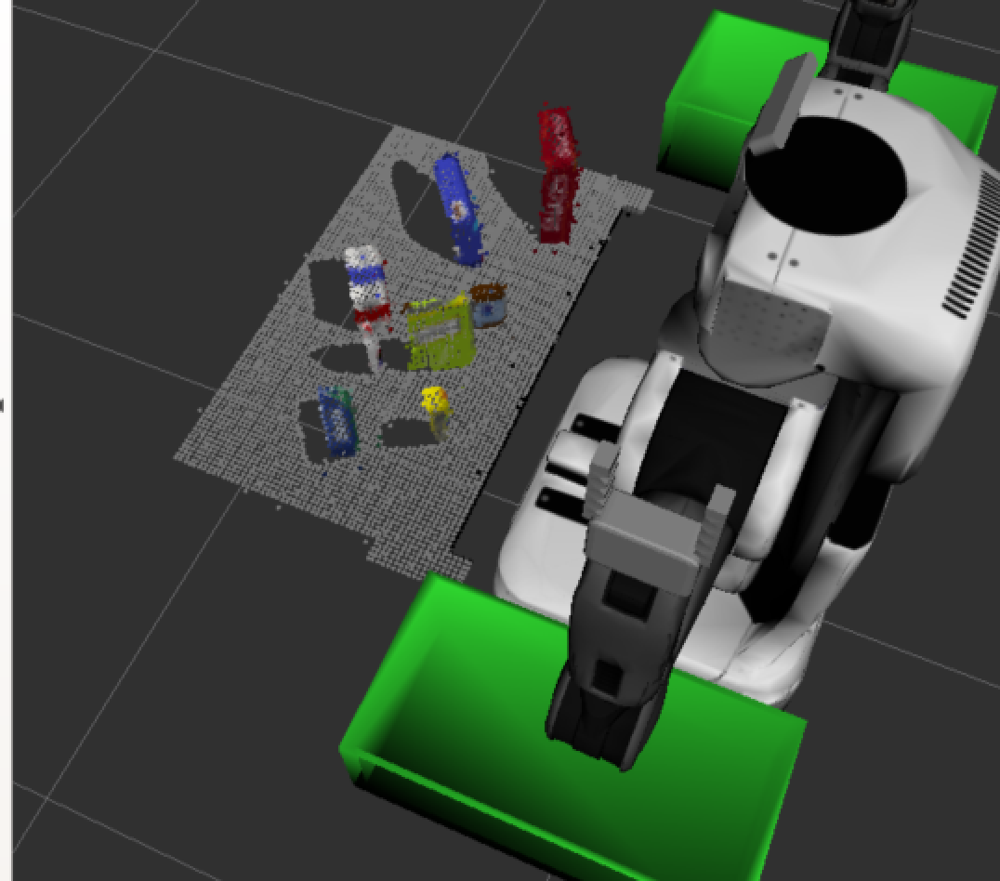
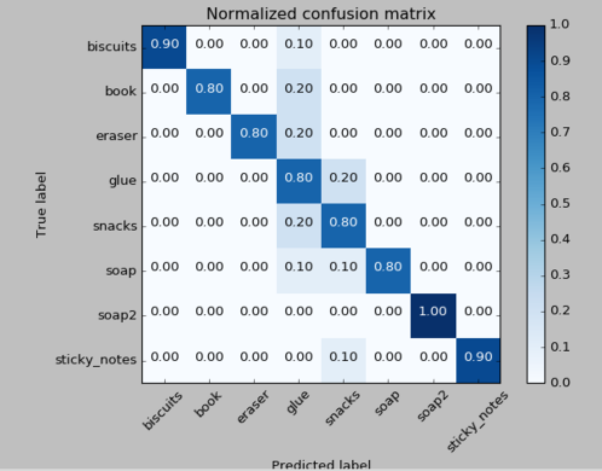

```{r setup, include=FALSE}
knitr::opts_chunk$set(echo = TRUE)
```

In this writeup, I will explain the code and the output in the file
`project_perception.py`, and will use world 3 as an example to show 
the outputs at different steps.

## Filtering and RANSAC plane fitting 
The image information from the robot's camera comes in as a ROS message, and in 
order to apply PCL tools on it, I need to convert the ROS message into PCL data
first:
```
    cloud = ros_to_pcl(pcl_msg)
```
After this, since the input image is usually noisy as shown in the following
image:


Thus, [**statistical outlier filtering**](http://pointclouds.org/documentation/tutorials/statistical_outlier.php) 
should be applied to remove all those
floating noisy points:
```
    outlier_filter = cloud.make_statistical_outlier_filter()
    n_neighbors = 10
    outlier_filter.set_mean_k(n_neighbors)
    thresh_scale = 1.0
    outlier_filter.set_std_dev_mul_thresh(thresh_scale)
    cloud_filtered = outlier_filter.filter()
```
Then, I got something like this:


To reduce the dimensionality, [**voxel grid downsampling**](http://pointclouds.org/documentation/tutorials/voxel_grid.php) 
should be applied (Note that I used 0.01 as the leaf_size here, but this is
just for illustration purpose. I used 0.005 to do the object recognition.):
```
    vox = cloud.make_voxel_grid_filter()
    LEAF_SIZE = 0.01
    vox.set_leaf_size(LEAF_SIZE,LEAF_SIZE,LEAF_SIZE)
    cloud_filtered = vox.filter()
```
which will give me the following result:


Since I am only interested in the objects on the table, I want to cut the 3d
space using [**passthrough filters**](http://docs.pointclouds.org/trunk/classpcl_1_1_pass_through.html)
on both 'z' and 'y' direction:
```
    passthrough = cloud_filtered.make_passthrough_filter()
    filter_axis = 'z'
    passthrough.set_filter_field_name(filter_axis)
    axis_min = 0.6
    axis_max = 1.1
    passthrough.set_filter_limits(axis_min,axis_max)
    cloud_filtered = passthrough.filter()
    
    passthrough = cloud_filtered.make_passthrough_filter()
    filter_axis = 'y'
    passthrough.set_filter_field_name(filter_axis)
    axis_min = -0.5
    axis_max = 0.5
    passthrough.set_filter_limits(axis_min,axis_max)
    cloud_filtered = passthrough.filter()
```
This will give me:



Note that the two small cluters on the two green boxes and the bottom of the 
table (blocked by the surface of the tabel) are gone if compared with the 
figure in the previous step.

I am going to separate the table and the objects by performing 
[**RANSAC plane segmentation**](http://pointclouds.org/documentation/tutorials/planar_segmentation.php):
```
    seg = cloud_filtered.make_segmenter()
    seg.set_model_type(pcl.SACMODEL_PLANE)
    seg.set_method_type(pcl.SAC_RANSAC)
    max_distance = 0.01
    seg.set_distance_threshold(max_distance)
    inliers,coefficients = seg.segment()
```
which will separatet the objects from the table as shown below:

 

## Clustering
Only position information (white cloud) is used to do the clustering, and the 
method used here is called [**DBSCAN**](https://en.wikipedia.org/wiki/DBSCAN), 
which represents Density-Based Spatial Clustering of Applications with Noise.
```
    white_cloud = XYZRGB_to_XYZ(extracted_outliers)
    tree = white_cloud.make_kdtree()
    ec = white_cloud.make_EuclideanClusterExtraction()
    ec.set_ClusterTolerance(0.01)
    ec.set_MinClusterSize(30)
    ec.set_MaxClusterSize(10000)
    ec.set_SearchMethod(tree)
    cluster_indices = ec.Extract()
```
Different colors will be assigned to different clusters:


## Object recognition 
The feature information used for object recognition are
normal historgrams and color histograms. First, I used the function
`capture_features.py` to generate a certain amount of the training samples for
each obejects in the world, and then use the function `train_svm.py` to
get a SVM classifier that is ready to be used for object recognition. To get a 
sense of the accuracy, I provided the confusion matrix below:



## Final results
I used the world 3 to train the classifier and obtained a single model that could be used to 
classify and label objects for all the 3 worlds. I showed the corresponding results as follows:

### World 1


### World 2


### World 3


## Discussion
I have implemented filtering, segmentation and clustering algorithms on point 
cloud data to get the centroid positions of the objects that are supposed to be
picked up by the PR2 robot. So far, everything worked smoothly, and I correctly
labelled all the objects in the 3 world files. I did not proceed to do the 
challenge due to time issues. I did not get 100% accuracy during training as
shown by the confusion matrix for the world 3 (confusion matrices for 
world 1 and 2 are not shown). However, but tuning certain parameters in the
algorithms, such as leaf_size in downsampling, higher accuracy during training
is achievable. One more thing to note is that I chose the bin number in the
function `compute_normal_histograms()` to be 1, because larger bin number 
give bad results. This seems strange, since it means shape information is not 
important at all. My understanding is that the objects provided by the 3 world
files are very similar to each other in their shapes, and thus, more shape information
could bring confusion to the classifier. I also tried to reduce the feature
space of color to avoid overfitting, and tried to use other kernels of SVM. However, 
so far, 32 bins of color histograms , 1 bin of shape normal histograms and 'rbf' kernel 
of SVM worked the best. I still have some doubt on this, and further investigation might 
be needed.
